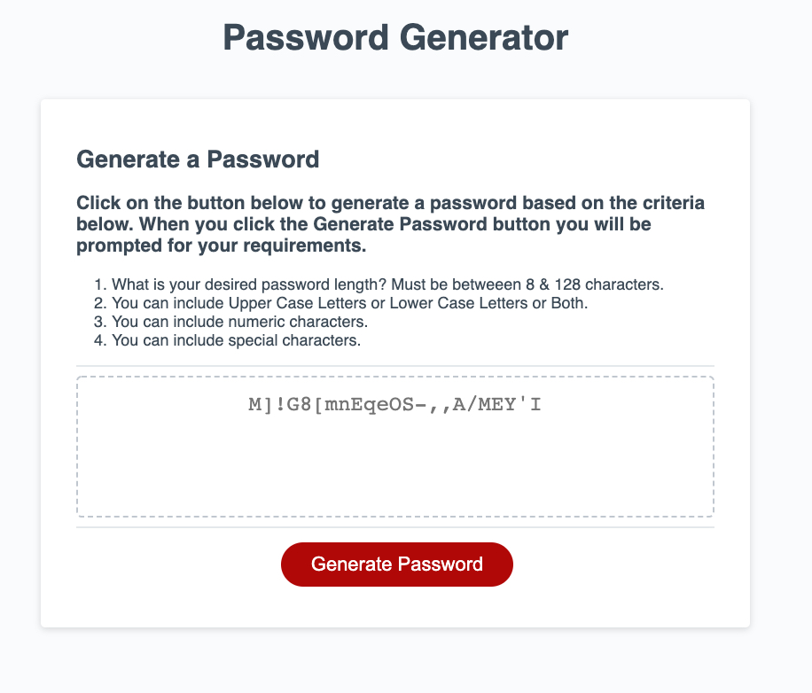

# PWGenerator
Javascript Homework

## Description 

This is currently a single web page with links to other pages. It generates a password that can be copied and used elsewhere based on input required from teh user when they click the Generate Password button. They must indicate whether to include upper case characters, lower case characters, numbers and or special characters. If they say no to include upper, lower and numbers then it just uses all special characters.

## Table of Contents (Optional)

This README is very not long but here is a table of contents nonetheless.

* [Installation](#installation)
* [Usage](#usage)
* [Credits](#credits)
* [License](#license)

## Installation

The site is a single page html document so installation is straightforward: (1) push code to Github (2) Navigate to live link and make sure the site displays correctly.

The site can be reached at [PW Generator](https://mark-artim.github.io/PWGenerator/) 

## Usage 

The current website as of 2/22/2021 looks like this:

## Credits

The following stackoverflow was instrumental in my understanding of generating random charcters from a set of characters:

https://stackoverflow.com/questions/1349404/generate-random-string-characters-in-javascript 

## License

I am not sure what exactly we shoudl do for licensing and I (hope) itis not critical to this assignemnt but it might look soemthign like this:

All rights, including copyright, of all text, images, code, information, and other material contained in the Horiseon.com website are owned by Horiseon.com and are protected by International Copyright Legislation. 

---

## Contributing

None at this time.

## Tests

No automated test exist at this time.
